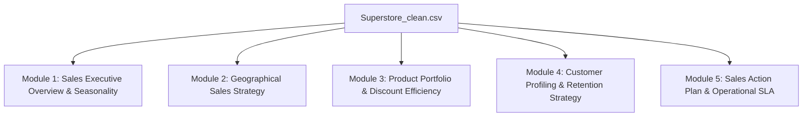

# KẾ HOẠCH PHÂN TÍCH DỮ LIỆU SUPERSTORE DÀNH CHO TRƯỞNG PHÒNG SALES
**(SUPERSTORE SALES ANALYTICS & STRATEGY PLAN)**

> **Dataset:** `Superstore_clean.csv`  
> **Môi trường thực hiện:** JupyterLab (Python: `pandas`, `numpy`, `seaborn`, `matplotlib`, `plotly`)  
> **Đối tượng sử dụng:** Sales Director / Sales Manager  
> **Mục tiêu kinh doanh:** Tăng trưởng doanh thu bền vững, bảo vệ biên lợi nhuận, khắc phục 6 điểm mù bán hàng & tối ưu nguồn lực đội ngũ Sales.

---

## I. CHÂN DUNG & MỤC TIÊU CỦA TRƯỞNG PHÒNG SALES (TARGET PERSONA)

* **Vai trò:** Chịu trách nhiệm hoàn thành chỉ tiêu doanh số (Revenue Quota), mở rộng thị trường, phát triển đội ngũ bán hàng và đảm bảo hiệu quả lợi nhuận.
* **Tư duy phân tích (Divide & Conquer):** Chia nhỏ câu hỏi lớn *"Làm sao để tăng doanh thu?"* thành các module phân tích chuyên biệt theo chuẩn kim tự tháp BI:  
  `KPI Tổng Quan ➔ Phân Tích Chi Tiết ➔ Nhận Diện Điểm Mù ➔ Đề Xuất Hành Động`.

---

## II. GIẢI QUYẾT 6 NỖI ĐAU & ĐIỂM MÙ CỐT LÕI (PAIN POINTS & BLIND SPOTS)

| # | Nỗi đau / Điểm mù thực tế | Nguyên nhân từ dữ liệu thô | Giải pháp Dữ liệu & Tính năng khắc phục |
|---|---|---|---|
| **1** | **Bẫy Doanh thu ảo – Lợi nhuận âm** *(Discount Trap)* | Sales lạm dụng Discount (20%-70%) để chạy theo KPI Sales, gây lỗ nặng. | Xây dựng ma trận **Sales vs Discount vs Profit Margin**; xác định **"Ngưỡng chiết khấu an toàn"** (Safe Zone). |
| **2** | **Tốn sức cào bằng khách hàng** *(Equal Effort)* | Dành thời gian chăm sóc đơn $15 tương đương đơn $2,000. | Áp dụng **Quy tắc Pareto (80/20)** & Phân hạng khách hàng (`Basket Size Tier`, `VIP Account`). |
| **3** | **Bán sai sản phẩm cho sai thị trường** *(Product Mismatch)* | Chào bán sản phẩm giá cao ở khu vực sức mua kém hoặc sai gu. | Lập ma trận **Product-Geography Matching** (Mỗi Vùng/Bang nên đẩy mạnh Sub-Category nào). |
| **4** | **Sốc vì tính mùa vụ & Áp lực KPI cào bằng** | KPI giao bằng nhau 12 tháng; hoảng loạn Q1/Q2, quá tải Q4. | Tính **Seasonality Index (Q1-Q4)**; chuyển sang giao **Chỉ tiêu KPI Động (Dynamic Quota)**. |
| **5** | **Chảy máu khách hàng cũ** *(Customer Churn)* | Mải tìm khách mới, bỏ quên khách cũ không mua lại > 180 ngày. | Tính chỉ số **Recency**; xuất danh sách **At-Risk Customers** để chạy chiến dịch Re-engagement. |
| **6** | **Hứa hươu hứa vượn về tiến độ giao hàng** | Hứa giao 2 ngày không căn cứ, dẫn đến hủy đơn & cãi nhau với Logistics. | Phân tích **Ship Lead Time (Days)** thực tế theo Vùng & Ship Mode để thiết lập SLA chuẩn cho Sales. |

---

## III. KẾ HOẠCH PHÂN TÁCH DỮ LIỆU (FEATURE ENGINEERING PLAN)

Để phục vụ phân tích "Chia để trị", dataset `Superstore_clean.csv` sẽ được bổ sung các cột thuộc tính tính toán (Derived Columns) sau:

### 1. Nhóm Thời Gian & Mùa Vụ (Temporal Features)
* `Year_Month`: Định dạng `YYYY-MM` dùng cho biểu đồ chuỗi thời gian liên tục (Time-Series).
* `Day_Of_Week` & `Is_Weekend`: Nhận diện ngày chốt đơn trong tuần (Phân biệt B2B vs B2C).
* `Seasonality_Phase`: Phân loại 3 giai đoạn: `Low Season (Q1-Q2)`, `Mid Season (Q3)`, `Peak Season (Q4)`.

### 2. Nhóm Tài Chính & Chiết Khấu (Financial Features)
* `Gross_Sales`: Doanh thu trước giảm giá $= \frac{\text{Sales}}{1 - \text{Discount}}$.
* `Discount_Amount`: Số tiền giảm giá thực tế $= \text{Gross\_Sales} - \text{Sales}$.
* `Discount_Tier`: Phân cấp chiết khấu (`No Discount`, `Low 0-15%`, `Medium 15-30%`, `Heavy >30%`).
* `Profit_Margin_%`: Tỷ suất lợi nhuận $= \frac{\text{Profit}}{\text{Sales}} \times 100\%$.
* `Profit_Tier`: Phân hạng sinh lời (`Heavy Loss`, `Minor Loss`, `Profitable`, `High Profit`).

### 3. Nhóm Đơn Hàng & Sản Phẩm (Basket & Product Features)
* `Unit_Price`: Đơn giá gốc sản phẩm $= \frac{\text{Gross\_Sales}}{\text{Quantity}}$.
* `Total_Order_Value`: Tổng tiền cả đơn hàng (Gộp theo `Order ID`).
* `Order_Basket_Size`: Phân hạng đơn (`Small <$100`, `Medium $100-$500`, `Large $500-$2000`, `Enterprise >$2000`).

### 4. Nhóm Khách Hàng (Customer Behavioral Profiling)
* `Customer_Order_Count`: Số lần mua hàng tích lũy của khách.
* `Customer_Loyalty_Tier`: Hạng khách hàng (`New/1-Time`, `Repeat 2-4`, `VIP >=5`).
* `Customer_CLV`: Tổng doanh số đóng góp lũy kế (Customer Lifetime Value).
* `Is_Top_20_VIP`: Đánh dấu top 20% khách hàng đóng góp 80% doanh thu (Pareto).
* `Recency_Days`: Số ngày kể từ lần chốt đơn cuối cùng của khách hàng.

### 5. Nhóm Địa Lý (Geographical Market Tiers)
* `State_Sales_Tier`: Phân hạng Bang (`Tier 1 Key States`, `Tier 2 Secondary`, `Tier 3 Niche`).

---

## IV. CẤU TRÚC PHÂN TÍCH 5 MODULE TRÊN JUPYTERLAB

Tất cả phân tích sẽ triển khai trên JupyterLab với cấu trúc Notebook chuẩn Data Storytelling:

### Module 1: Executive Sales Overview & Growth Dynamics
* **Mục tiêu:** Cho Sales Director cái nhìn toàn cảnh về Doanh thu, Tăng trưởng & Chu kỳ mùa vụ.
* **KPI Cards:** Total Sales, Total Profit, Average Order Value (AOV), Profit Margin %, YoY Growth %.
* **Visuals:** 
  * Biểu đồ đường `Year_Month`: Xu hướng doanh thu qua 48 tháng.
  * Bar chart `Seasonality_Phase`: So sánh tỷ trọng doanh thu giữa các Quý (Q1 - Q4).
* **Kết luận & Insight:** Xác định chu kỳ bùng nổ doanh số Q4 và chỉ số tăng trưởng hàng năm.

### Module 2: Geographical Sales Strategy (Khu Vực & Bang Trọng Điểm)
* **Mục tiêu:** Nhận diện thị trường gánh doanh số và thị trường yếu kém.
* **Visuals:**
  * Map / Bar chart `Region`: So sánh Sales & Profit giữa West, East, Central, South.
  * Top 10 States & Cities đóng góp doanh thu lớn nhất.
  * Treemap `State_Sales_Tier`: Phân bổ doanh số theo Tier 1, Tier 2, Tier 3.
* **Kết luận & Insight:** Xác định vùng tăng trưởng mạnh (West) và vùng cần can thiệp (South/Central).

### Module 3: Product Portfolio & Discount Efficiency (Sản Phẩm & Chiết Khấu)
* **Mục tiêu:** Triệt phá "Bẫy chiết khấu", tìm ra sản phẩm mũi nhọn và sản phẩm gây lỗ.
* **Visuals:**
  * Sunburst / Treemap: Cơ cấu Doanh thu theo `Category ➔ Sub-Category`.
  * Scatter Plot: `Sales` vs `Discount` vs `Profit Margin %` (Tương quan giảm giá và lợi nhuận).
  * Bar chart `Discount_Tier`: Tỷ lệ đơn hàng âm vốn theo mức chiết khấu.
* **Kết luận & Insight:** Thiết lập trần chiết khấu an toàn cho nhóm Tables, Bookcases & Binders.

### Module 4: Customer Profiling & Retention Strategy (Khách Hàng & Giữ Chân)
* **Mục tiêu:** Tập trung nguồn lực cho khách hàng VIP, khôi phục khách hàng sắp mất.
* **Visuals:**
  * Donut chart `Segment`: Cơ cấu đóng góp (Consumer, Corporate, Home Office).
  * Pareto Chart: Đường tích lũy 80/20 của Top Customers.
  * Histogram `Recency_Days`: Nhận diện nhóm khách lặn mất tăm > 180 ngày.
* **Kết luận & Insight:** Xuất danh sách **Top 20% VIP Customers** và **At-Risk Customers** cho đội Sales.

### Module 5: Sales Action Plan & Operational SLA (Hành Động & SLA Giao Hàng)
* **Mục tiêu:** Đưa ra chiến lược kinh doanh cụ thể và thiết lập cam kết thời gian giao hàng.
* **Visuals:**
  * Boxplot `Ship Lead Time (Days)` theo `Ship Mode` và `Region`.
  * Bảng tổng hợp khuyến nghị hành động chiến lược (Strategic Matrix).
* **Kết luận & Action Plan:** Bảng SLA thời gian giao hàng chuẩn + Đề xuất chính sách thưởng/phạt cho Sales.

---

## V. LỘ TRÌNH THỰC HIỆN TRÊN JUPYTERLAB (IMPLEMENTATION ROADMAP)

1. **Bước 1: Import & Preprocessing Data**
   * Nạp `Superstore_clean.csv`, kiểm tra kiểu dữ liệu, kiểm tra tính toàn vẹn (0 null, 0 duplicate).
2. **Bước 2: Feature Engineering Pipeline**
   * Tạo 15+ cột mới thuộc 5 nhóm thuộc tính bằng Pandas.
3. **Bước 3: Xây dựng 5 Module Phân tích & Trực quan hóa**
   * Triển khai code Python vẽ đồ họa đẹp mắt (`Seaborn` / `Plotly`).
4. **Bước 4: Viết Markdown Storytelling & Action Recommendations**
   * Tổng hợp các phát hiện chính (Key Findings), cảnh báo điểm mù và bảng đề xuất hành động.

---
*Kế hoạch được lập ngày 29/07/2026 – Sẵn sàng chuyển sang giai đoạn thực thi code trên JupyterLab.*
